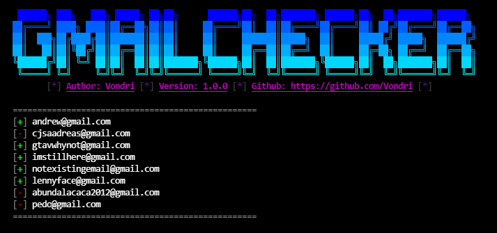

<div align="center">
  
  <h3>
    📧Gmail checker📧<br>
    ✔ v1.0.0 ✔<br>
    Created by <a href="https://gtihub.com/vondri">Vondri</a>
  </h3>
</div>

<div align="center">
  
  
  
  
  
  
</div>

* * * * * * * * *
## Features
- [x] 📝 Script work with params e.g `-h` 📝
- [x] 🔇 Silent mode (run without banner) 🔇
- [x] ✍ Writing valid and invalid users to another files ✍
- [x] ⌚ Timeout beetwen checks ⌚
- [x] 🔍 Possibility to check single email 🔍

## Requirements
  
  
  
  
  

## Usage
* #### Linux
    ```
    git clone https://github.com/Vondri/admin-panel-finder.git
    cd gmailchecker
    chmod +x GmailChecker.py
    python GmailChecker.py -e <email>
    ```
* #### Windows
Download, extract zip and run script by `python GmailChecker.py -e <email>`

## Usage
```
python GmailChecker.py -u <userlist.txt> -o -i -t1
```
It will check all users in `userlist.txt` and print to another files valid and invalid users. Timout equal one second between checks.

* * * 

```
python GmailChecker.py -e <email>
``` 
It will check one user.
* * *
```
python GmailChecker.py -s -u <userlist.txt>
```
It will run script without banner and print result of scan.
